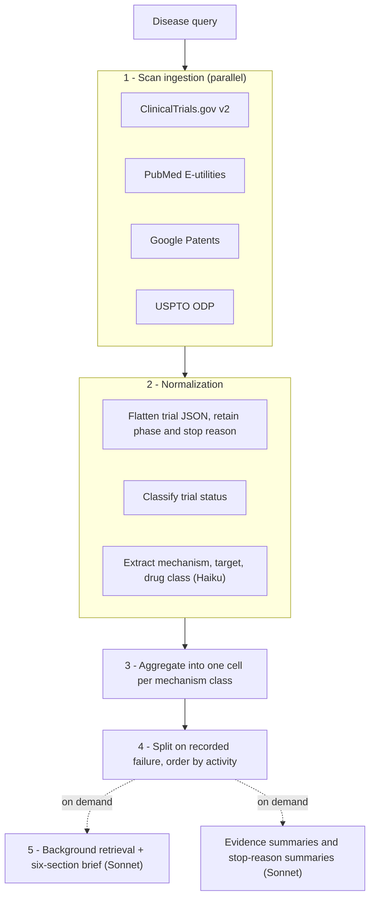

# IndicationScope

**Disease intelligence briefs from registered trials, published literature and patents.**
Enter a disease; IndicationScope retrieves the clinical and literature record and produces
a structured, cited brief covering the disease's biology, epidemiology, current treatment,
active research, and the history of stopped or negative trials.

**Live:** [marufhoque.com/tools/indicationscope](https://www.marufhoque.com/tools/indicationscope)

---

## What a brief contains

1. **Disease Overview & Symptoms**
2. **Molecular Mechanisms & Affected Proteins**
3. **Disease Population & Epidemiology**
4. **Current Standard of Treatment** — including treatment cost where a source reports it
5. **Clinical Research Currently Being Conducted**
6. **Historical Context of Trial Failures** — drawn from registered termination reasons

Every statement cites a PMID or NCT ID. The brief is written in a formal, descriptive
register: it reports what the sources state and does not characterise mechanisms or
disease areas as opportunities, crowded, promising or otherwise, and does not advise.
When the retrieved sources do not address a section, the brief says so.

Alongside the brief:

- **Clinical Landscape** — mechanism classes found in the examined trials and literature,
  with molecular target, drug class, trial counts by phase and status, and matching
  abstracts, grouped by treatment modality and ordered by number of active trials.
- **Previously Attempted** — mechanism classes with a trial recorded as terminated or
  completed with a negative result, with an on-demand summary of the stated reasons.
- **Key Players** — trial sponsors, patent assignees and publication authors.
- **Publication volume and trial phases** — publications per year and phase mix.
- **PDF export** — a printable report of all sections.

---

## How it works



**1. Scan ingestion.** Four sources are queried concurrently. Each returns a *true total*
plus a *sample*: `countTotal=true` on ClinicalTrials.gov and `esearch`'s `Count` on PubMed
report full match counts without paginating through them.

**2. Normalization.** Trial records are flattened, keeping phase, lead sponsor and the
registered `whyStopped` text, and `overallStatus` is mapped to a status taxonomy
(`ACTIVE`, `COMPLETED_POSITIVE`, `COMPLETED_NEGATIVE`, `TERMINATED`, `WITHDRAWN`,
`UNKNOWN`). A completed trial with no posted results is `UNKNOWN`, never assumed positive.
Mechanism class, molecular target and drug class are extracted from intervention names
and abstracts by Claude Haiku.

**3. Aggregation.** Records are grouped into one cell per mechanism class, with labels
canonicalized so formatting variants of the same mechanism merge. Matching-abstract counts
are computed deterministically over every examined abstract, using document frequency so
that terms common to the whole corpus do not count as matches.

**4. Organisation.** Cells with a terminated or negative trial go to **Previously
Attempted**; the rest form the **Clinical Landscape**. Both are ordered by active trials,
then Phase 3/4 trials, then total trials. No score is computed.

**5. Brief.** The brief is generated on demand. It combines the scan's aggregated evidence
with a small, relevance-ranked PubMed retrieval for disease overview, epidemiology and cost
of illness — material the scan's recency-ordered sample does not provide — and is
calibrated to how much of the registry and literature the scan examined.

---

## Data sources

| Source | Access | Provides |
|---|---|---|
| **ClinicalTrials.gov v2** | Open | Trials, status, phase, interventions, sponsors, `whyStopped` |
| **PubMed** (E-utilities) | Open — `NCBI_API_KEY` raises rate limits | Abstracts, authors, MeSH, dates, per-year counts, background literature |
| **Google Patents** | Undocumented JSON endpoint | Patent titles, abstracts, assignees |
| **USPTO Open Data Portal** | Requires `USPTO_API_KEY` | Application metadata, status |

Any source that fails degrades to empty rather than failing the request.

---

## API

Mounted at both `/api/*` and `/tools/indicationscope/api/*` (see [Deployment](#deployment)).

| Endpoint | Purpose |
|---|---|
| `GET /health` | Liveness |
| `POST /scan` | `{ disease, mechanism? }` → counts, `mechanisms`, `previously_attempted`, phases, publication trend, organisations, authors, and `briefing_context` |
| `POST /briefing` | `{ indication, context, coverage_note }` → the six brief sections plus `references` for the background literature retrieved |
| `POST /rationale` | One mechanism's evidence summary, from the `context` returned by `/scan` |
| `POST /failure-analysis` | Summary of registered stop reasons for one mechanism |

The synthesis endpoints are **stateless**: the client posts back the context `/scan`
returned, so a cold serverless instance never re-runs ingestion.

---

## Running locally

**Requirements:** Node 18+, Python 3.11+

```bash
git clone https://github.com/marufmhoque/IndicationScope.git
cd IndicationScope
npm install
pip install -r requirements.txt
cp .env.example .env.local
```

Fill in `ANTHROPIC_API_KEY` in `.env.local`, then run two processes in two terminals:

```bash
py -m uvicorn api.index:app --reload --port 8000
```

```bash
npm run dev
```

Open **http://localhost:3000/tools/indicationscope** — `basePath` is set, so the app does
not serve at the root.

| Variable | Required | Effect if absent |
|---|---|---|
| `ANTHROPIC_API_KEY` | **Yes** | No mechanism classification, brief or summaries |
| `NCBI_API_KEY` | No | Lower PubMed rate limits; per-year and background queries may be throttled on shared hosting |
| `USPTO_API_KEY` | No | USPTO source returns nothing ([free key](https://data.uspto.gov/)) |

---

## Deployment

Deployed on **Vercel Hobby**, which caps serverless functions at **60s**. The scan and the
brief run as separate requests, each within that ceiling.

The app is served under `/tools/indicationscope` on a portfolio site that proxies to it.
`basePath` in `next.config.mjs` and the portfolio's rewrite must agree, and the rewrite
must preserve the prefix; if they disagree the JS bundles 404 and the page renders inert.
`basePath` does not prefix `fetch()`, so client code builds API URLs through
`app/lib/paths.ts`.

Serverless constraints handled in code: only `/tmp` is writable (the SQLite caches use it
and degrade to no-ops on failure); clients are constructed lazily so an init failure cannot
500 every route; responses carry aggregates rather than raw records; and a wall-clock guard
sizes classification to the remaining budget.

---

## Known limitations

- **Samples, not a census.** For large diseases the scan examines a small share of
  registered trials and publications. Counts describe the examined records; the UI and the
  brief state the share.
- **Background literature varies by disease.** Relevance-ranked retrieval finds reviews
  and epidemiology papers for well-studied diseases; rare diseases may have few or none,
  and cost data is often absent.
- **Mechanism labels are model-generated.** Canonicalization merges formatting variants,
  but differently phrased equivalent labels can still split.
- **Objectivity is enforced by prompt.** The prompts prohibit evaluative language, but
  model output should be read as a draft summary of the cited sources.
- **Trial registration is not approval.** The data contains no regulatory status; Phase 4
  indicates post-marketing study only.
- **Google Patents** uses an undocumented endpoint that throttles by IP.

---

## Disclaimer

A research aid, not clinical, regulatory or investment guidance. All narrative content is
model-generated from the listed sources. Verify every cited PMID and NCT ID before relying
on it.

---

## License

[Apache 2.0](LICENSE)
