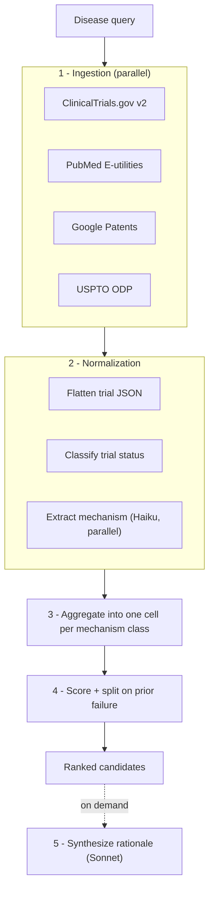

# IndicationScope

**Drug-repurposing white-space discovery.** Give it a disease; it surveys the clinical
trial, literature, and patent landscape, clusters what it finds by mechanism of action,
and surfaces the mechanisms nobody has meaningfully pursued yet — with a cited rationale
for each.

**Live:** [marufhoque.com/tools/indicationscope](https://www.marufhoque.com/tools/indicationscope)

---

## The idea

A mechanism–indication pair is interesting when the biology is plausible and the
literature is growing, but the clinical landscape is empty. That's *white space*.

The hard part is that "empty" is ambiguous. A mechanism with no trials might be
genuinely unexplored — or it might have been tried and quietly failed. IndicationScope
separates those: trials are classified into a five-state taxonomy, and any mechanism
carrying a prior-failure signal is pulled out of the candidate list into a
**Previously Attempted** section rather than being scored as opportunity.

---

## How it works



**1. Ingestion.** Four sources queried concurrently. Each returns a *true total* plus a
*sample*: `countTotal=true` on ClinicalTrials.gov and `esearch`'s `Count` on PubMed both
report full match counts without paginating through them. A query for "diabetes" reports
all ~24,000 trials while fetching 100 — counts stay honest, cost stays bounded.

**2. Normalization.** Trial JSON is flattened, then `overallStatus` + `whyStopped` are
mapped to a five-state taxonomy. A trial terminated for "lack of efficacy" becomes
`COMPLETED_NEGATIVE`, not merely `TERMINATED` — failures must not be silently dropped,
because a failure is the strongest evidence *against* white space. Mechanism of action is
then extracted from intervention names and abstracts by Claude Haiku, run in parallel.

**3. Aggregation.** Records are grouped into one cell per mechanism class. Labels are
canonicalized before grouping: independent extraction calls phrase the same mechanism
differently often enough that `orexin-2 receptor agonist`, `orexin 2 receptor agonist`,
and `Orexin receptor 2 agonist` would otherwise become three separate results. Agonist
and antagonist are deliberately kept distinct.

**4. Scoring.** Each cell is scored, then split: prior-failure cells go to
**Previously Attempted**, the rest are ranked as candidates.

**5. Synthesis.** Claude Sonnet writes a rationale per candidate, on demand. The prompt
is strictly retrieval-augmented — the model may cite only the supplied sources, must
reference each claim by PMID or NCT ID, and is instructed to say so plainly when evidence
is thin rather than overstate it.

---

## Data sources

| Source | Access | Provides |
|---|---|---|
| **ClinicalTrials.gov v2** | Open | Trials, status, interventions, `whyStopped` |
| **PubMed** (E-utilities) | Open — `NCBI_API_KEY` raises rate limits | Titles, abstracts, MeSH, dates |
| **Google Patents** | Undocumented JSON endpoint | Patent titles, abstracts, assignees |
| **USPTO Open Data Portal** | Requires `USPTO_API_KEY` | Application metadata, status |

Any source that fails degrades to empty rather than failing the scan. Google Patents
throttles by IP and will intermittently return nothing; USPTO stays inert without a key.
The other sources carry the result in both cases.

---

## Scoring

```
white_space_score =
    0.35 * rationale_strength        publication volume, saturating at 20
  + 0.25 * publication_growth_rate   fraction of publications from the last 3 years
  + 0.20 * population_fit            placeholder — see limitations
  - 0.15 * active_trial_density      ACTIVE / total trials, i.e. how crowded
  - 0.30 * failure_penalty           1.0 if any prior failure
```

Clamped to `[0, 1]`. Cells with `has_prior_failure` are excluded from candidates
regardless of score.

**Trial status taxonomy:** `ACTIVE`, `COMPLETED_POSITIVE`, `COMPLETED_NEGATIVE`,
`TERMINATED`, `WITHDRAWN`, `UNKNOWN`. A completed trial with no posted results is
`UNKNOWN`, never assumed positive.

---

## API

Mounted at both `/api/*` and `/tools/indicationscope/api/*` (see [Deployment](#deployment)).

### `GET /health`

```json
{ "status": "ok" }
```

### `POST /scan`

```jsonc
// request
{ "disease": "narcolepsy", "mechanism": null, "persona": "academic" }
```

```jsonc
// response (abridged)
{
  "query": { "disease": "narcolepsy", "mechanism": null, "persona": "academic" },
  "generated_at": "2026-09-11T22:41:00Z",

  // *_count is the true number of matches; *_analyzed is what was classified.
  // These differ by orders of magnitude for common diseases.
  "trial_count": 175,        "trials_analyzed": 100,
  "publication_count": 7474, "publications_analyzed": 59,
  "patent_count": 76656,     "patents_analyzed": 20,

  "candidates": [
    {
      "mechanism_class": "orexin receptor 2-selective agonist",
      "indication": "narcolepsy",
      "trial_count_by_status": { "ACTIVE": 2, "COMPLETED_POSITIVE": 1 },
      "publication_count": 3,
      "publication_growth_rate": 0.67,
      "white_space_score": 0.37,
      "has_prior_failure": false,
      "rationale": null,
      "supporting_pmids": ["42714024"],
      "supporting_nct_ids": ["NCT06470828"],
      // Only on the top 5. Passed back to /rationale.
      "context": {
        "abstracts": ["PMID 42714024: ..."],
        "trial_summaries": ["NCT06470828: ..."]
      }
    }
  ],
  "previously_attempted": []
}
```

### `POST /rationale`

Deliberately **stateless** — the client passes back the `context` block from `/scan`.
Re-deriving it server-side would mean re-running ingestion, and the serverless cache is
per-instance, so a cold start would refetch everything.

```jsonc
// request
{
  "mechanism_class": "orexin receptor 2-selective agonist",
  "indication": "narcolepsy",
  "supporting_pmids": ["42714024"],
  "supporting_nct_ids": ["NCT06470828"],
  "abstracts": ["PMID 42714024: ..."],
  "trial_summaries": ["NCT06470828: ..."]
}
```

```jsonc
// response
{
  "rationale": "Narcolepsy type 1 is defined by orexin deficiency (PMID 42714024)...",
  "supporting_pmids": ["42714024"],
  "supporting_nct_ids": ["NCT06470828"]
}
```

`rationale` is `null` when synthesis is unavailable (no API key, or the model call
failed). The UI renders those cards without a rationale rather than promising one.

---

## Running locally

**Requirements:** Node 18+, Python 3.11+

```bash
git clone https://github.com/marufmhoque/IndicationScope.git
cd IndicationScope
npm install
pip install -r requirements.txt
cp .env.example .env.local
```

Fill in `ANTHROPIC_API_KEY` in `.env.local`, then run two processes in two terminals:

```bash
py -m uvicorn api.index:app --reload --port 8000
```

```bash
npm run dev
```

Open **http://localhost:3000/tools/indicationscope** — note the path; `basePath` is set,
so the app does not serve at the root. Next proxies `/api/*` to the FastAPI server in
development only (see `next.config.mjs`).

### Environment variables

| Variable | Required | Effect if absent |
|---|---|---|
| `ANTHROPIC_API_KEY` | **Yes** | No mechanism classification or rationales — everything collapses into one "Unclassified" bucket |
| `NCBI_API_KEY` | No | Lower PubMed rate limits |
| `USPTO_API_KEY` | No | USPTO source returns nothing ([free key](https://data.uspto.gov/)) |

Read from `.env.local` locally; set them in project settings when deployed.

---

## Deployment

Deployed on **Vercel Hobby**, which caps serverless functions at **60s** (default 10s).
Every design decision below follows from that ceiling. A full scan runs in **~6-8s**.

### The `basePath` coupling

The app is served under `/tools/indicationscope` on a portfolio site that proxies to it.
Two settings must agree, in two different repositories:

```js
// IndicationScope - next.config.mjs
basePath: "/tools/indicationscope"
```

```jsonc
// portfolio - vercel.json - the prefix must be PRESERVED, not stripped
{ "source": "/tools/indicationscope/:path*",
  "destination": "https://<app>.vercel.app/tools/indicationscope/:path*" }
```

**Change one without the other and the page breaks silently.** If the proxy strips the
prefix while `basePath` is set (or vice versa), the JS bundles 404, React never hydrates,
and the form renders as inert HTML — the submit button is server-rendered `disabled` and
only enables through React state, so typing appears to do nothing at all. No error is
shown anywhere.

`basePath` does **not** prefix `fetch()` — only assets, `next/link`, and router calls.
Client code builds API URLs through `app/lib/paths.ts`.

### Serverless constraints

- **Read-only filesystem.** Only `/tmp` is writable. The SQLite cache targets `/tmp` when
  serverless and degrades to a no-op on any failure — a cache must never be able to take
  down the API. `/tmp` is per-instance and ephemeral, so it only helps warm instances.
- **Lazy initialization.** Constructing clients at module scope turns any init failure
  into a boot-time 500 on *every* route, including `/health`.
- **Response size.** Raw source records are dropped from the response; only counts and
  scored cells are returned (~8KB, against a 4.5MB platform limit).
- **Time budget.** A wall-clock guard sizes mechanism extraction against the remaining
  budget and skips it entirely when time is short. The scan returns partial results
  rather than letting the platform kill the request — a 504 gives the user nothing.

---

## Project structure

```
api/index.py                  FastAPI app, both route mounts, time budget
pipeline/
  ingestion/
    orchestrator.py           Parallel fetch across sources + caching
    clinicaltrials_client.py  countTotal + sampled page
    pubmed_client.py          E-utilities over httpx, stdlib XML
    google_patents_client.py  Undocumented JSON endpoint, throttle-tolerant
    uspto_client.py           Open Data Portal, needs a key
    cache.py                  SQLite cache; never fatal
  normalization/
    trial_normalizer.py       Flatten CT.gov JSON
    entity_extraction.py      Mechanism extraction (Haiku, parallel)
    ontology_crosswalk.py     Stub - not wired in
  scoring/
    status_classifier.py      Five-state trial taxonomy
    matrix_builder.py         Aggregate + canonicalize mechanism labels
    white_space_score.py      Scoring formula and ranking
  synthesis/
    rationale_generator.py    Cited rationale (Sonnet)
    prompts/                  Extraction and synthesis prompts
app/                          Next.js App Router frontend
```

---

## Known limitations

These are real and deliberate; none are hidden behind a loading state.

- **`population_fit` is a fixed 0.5 placeholder.** No prevalence dataset is wired up, so
  the term contributes a constant to every score. It is inert, not estimated — wiring in
  an orphan-disease prevalence source would make it meaningful.
- **Analysis is a sample, not a census.** Roughly 100 trials and 60 publications are
  classified per scan regardless of how many matched. Reported totals are accurate; the
  *mechanism coverage* built from them is partial, and the UI labels both numbers
  separately for that reason.
- **`ontology_crosswalk.py` is an unimplemented stub** with an empty CSV, and is not
  called by the pipeline. Disease terms are used as typed, so synonyms (e.g. "ALS" vs
  "amyotrophic lateral sclerosis") do not unify.
- **Mechanism labels are LLM-generated free text.** Canonicalization merges obvious
  formatting variants, but semantically identical labels phrased differently can still
  split.
- **Google Patents uses an undocumented endpoint** that throttles by IP and returns 503
  in bursts. Treated as best-effort.
- **The cache is per-instance in production.** Repeat queries only hit it on a warm
  instance.
- **Persona is captured but does not yet affect scoring.**

---

## Disclaimer

A research triage aid, not clinical or investment guidance. Scores are heuristics over
incomplete public data, and rationales are model-generated from a sampled subset of
sources. Verify every cited PMID and NCT ID before acting on anything here.

---

## License

[Apache 2.0](LICENSE)
